# Education Dashboard

This repository showcases different modules with their respective details. Below is an overview of the modules, each with a screenshot to visually represent its functionality and data.

## Screenshots and Module Details

### **Login Page**

- **Description**: The login page provides a secure way for users (e.g., students, admins, staff) to log into the system. It includes fields for entering credentials such as email and password.
- **Key Functionality**:
  - **Email Field**: Allows users to enter their registered email.
  - **Password Field**: Users can enter their password, with an option to toggle visibility.
  - **Submit Button**: Once credentials are entered, users can click "Submit" to authenticate.
  - Provides a seamless login process for secure user access.

### **Dashboard Overview**

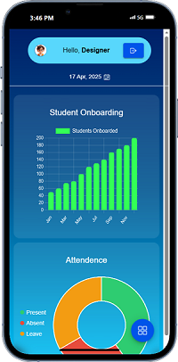 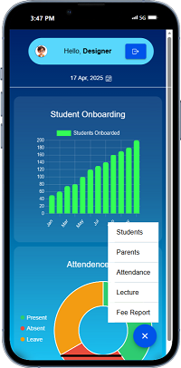

- **Description**: The dashboard gives a visual overview of student onboarding progress and attendance, along with a navigation menu for additional functionalities.
- **Key Functionality**:
  - **Student Onboarding**: A bar chart showing the number of students onboarded from January to November.
  - **Attendance**: A pie chart showing the attendance status of students (Present, Absent, and Leave).
  - Includes modules such as **Students**, **Parents**, **Attendance**, **Lecture**, and **Fee Report**.
  - Provides a quick snapshot of student data and engagement trends, with quick access to other sections via a floating button.

### **Student Management Overview**
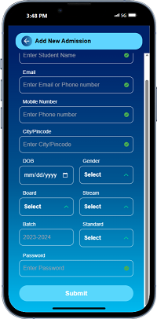 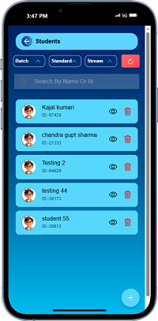 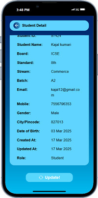

The **Student Management** section includes various functionalities such as adding new students, viewing the list of students, and managing student details.

- **Add New Admission**: This page allows you to add new students to the system. The form includes fields like student name, email, mobile number, date of birth, gender, and other details, along with a "Submit" button to trigger the form submission. 

- **Students List**: This page displays a list of all students in the system. It includes options to view or delete each student's information. The list can be filtered by **Batch**, **Standard**, and **Stream**. You can also search for students by name or ID. 

- **Student Detail**: This page shows detailed information about a specific student, such as **Student ID**, **Name**, **Board**, **Standard**, **Email**, **Mobile**, and more. It also provides an "Update" button to modify the student's information.

### **Parents Management Overview**
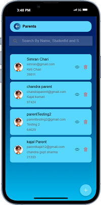 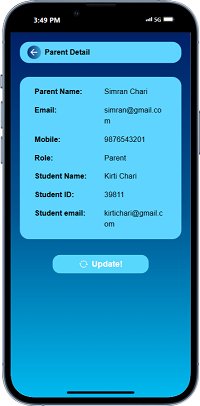

The **Parents Management** section allows managing the parents' data. This includes viewing a list of parents and updating their details.

- **Parents List**: This page displays a list of all parents in the system, with options to view or delete each parent's information. It also allows searching for parents by **Name**, **Student ID**, or **Student Name**. 

- **Parent Detail**: This page shows detailed information about a specific parent, such as **Parent Name**, **Email**, **Mobile**, **Student Name**, and **Student ID**. It also provides an "Update" button to modify the parent's information. 

### **Attendance Management**
  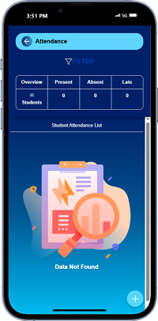 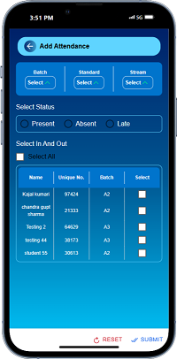

This module handles the student attendance process — from marking daily status to reviewing attendance records over time.

- **Add Attendance**: Allows teachers/staff to select the batch, standard, and stream. Students are listed in a table with options to mark them as **Present**, **Absent**, or **Late**. A **Select All** checkbox simplifies mass updates. Bottom actions include **Reset** and **Submit**.  
 

- **Attendance Overview**: Displays an overview of attendance stats — how many students were marked Present, Absent, or Late. If no data exists for the filters applied, a “Data Not Found” graphic is shown.  

### **Lecture Management Module**
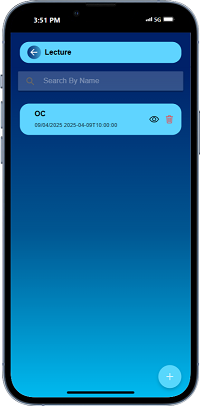 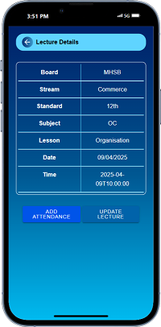 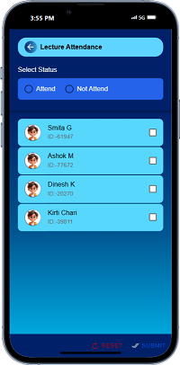

The **Lecture Management** section helps in scheduling, tracking, and managing lecture-based attendance and metadata.

- **Lecture List**: Displays a list of scheduled lectures. Each card shows the subject name and timestamp, with actions to view details or delete.  
  

- **Lecture Attendance**: Lets staff mark which students attended or missed a particular lecture. Students are listed with checkboxes and status toggle for **Attend** or **Not Attend**.  
  

- **Lecture Details**: Shows detailed information for each lecture — including Board, Stream, Standard, Subject, Lesson, Date & Time. Options include **Add Attendance** and **Update Lecture**.  

### **Fee Report Management**

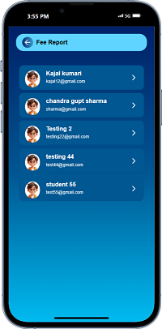 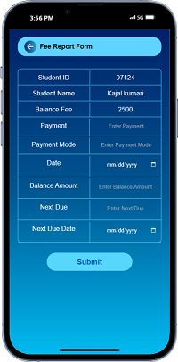 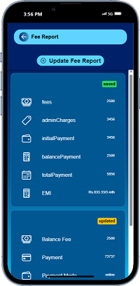

This module manages all student fee records, including updates and detailed breakdowns of payment components.

- **Fee Report List**: Displays all students with their associated email addresses. You can tap on any card to view or update their fee details.  
  
- **Fee Report Details**: Shows the breakdown of each student's fee structure — including **Fees**, **Admin Charges**, **Initial Payment**, **Balance**, **Total Payment**, and **EMI**. Each section is tagged with a status like **saved** or **updated**.  
  
- **Fee Report Form**: Allows fee data to be added or updated. It includes inputs for **Student ID**, **Payment Amount**, **Payment Mode**, **Balance Fee**, and upcoming due dates.  
  

  
